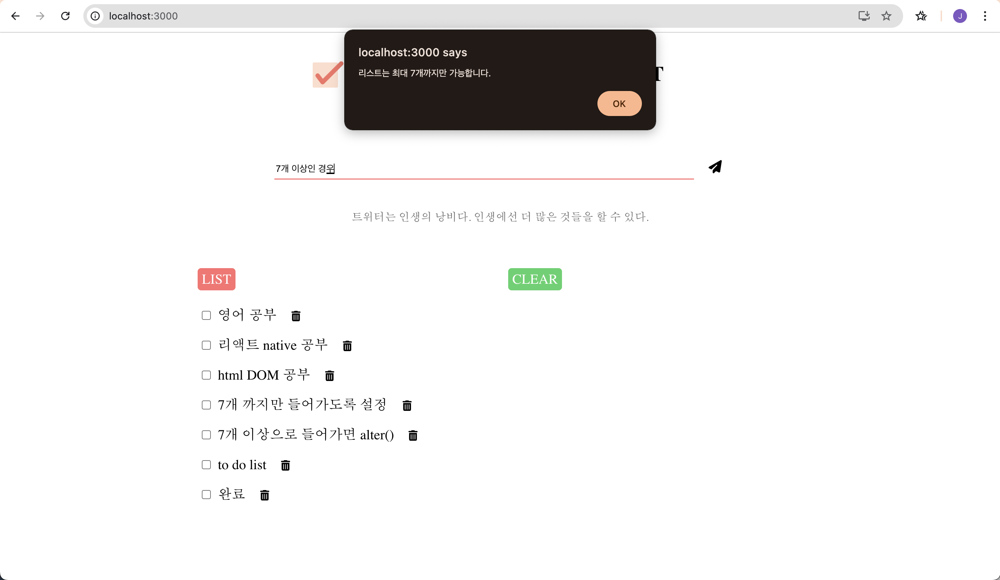
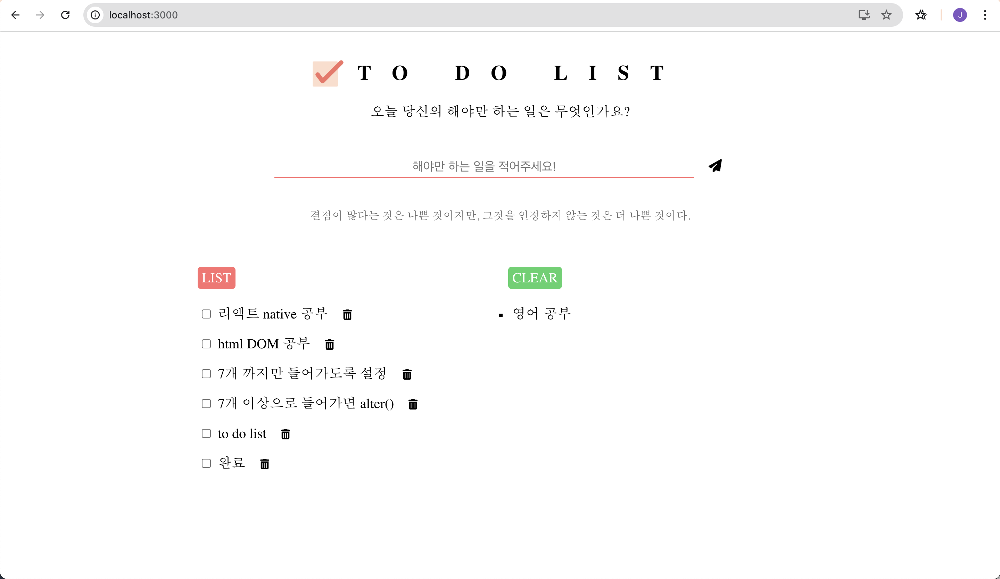

# example_zip
프론트엔드 사용 언어 예제

주제 - To Do List
해야하는 일을 추가, 삭제 하는 기능을 넣음  
한국어로 번역된 조언 API를 활용하여 랜덤 조언으로 사용자에게 응원을 해주는 용도로 사용
    - 한국어로 번역된 조언 API : https://github.com/chkim116/kadvice?tab=readme-ov-file

1. react_example
React로 코드를 구성하였다.
    1-1. DB 연결 전
    
    